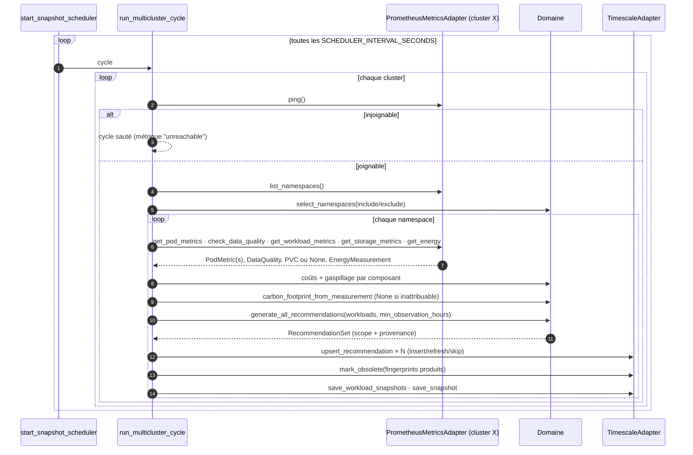
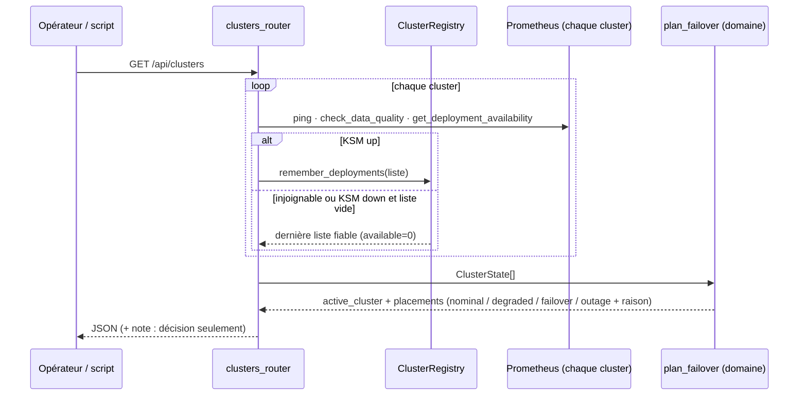
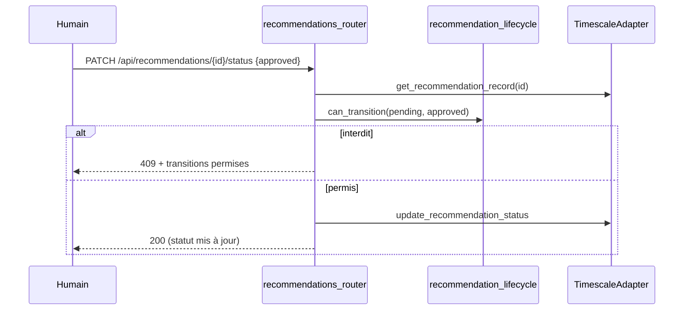

# Diagramme 2 — Flux principaux (V1)

> Retour : [DATA_FLOW](../DATA_FLOW.md)

## 2.a Cycle du scheduler (multicluster)

```mermaid
sequenceDiagram
    autonumber
    participant S as start_snapshot_scheduler
    participant R as run_multicluster_cycle
    participant P as PrometheusMetricsAdapter (cluster X)
    participant D as Domaine
    participant T as TimescaleAdapter
    loop toutes les SCHEDULER_INTERVAL_SECONDS
        S->>R: cycle
        loop chaque cluster
            R->>P: ping()
            alt injoignable
                R-->>R: cycle sauté (métrique "unreachable")
            else joignable
                R->>P: list_namespaces()
                R->>D: select_namespaces(include/exclude)
                loop chaque namespace
                    R->>P: get_pod_metrics · check_data_quality · get_workload_metrics · get_storage_metrics · get_energy
                    P-->>R: PodMetric(s), DataQuality, PVC ou None, EnergyMeasurement
                    R->>D: coûts + gaspillage par composant
                    R->>D: carbon_footprint_from_measurement (None si inattribuable)
                    R->>D: generate_all_recommendations(workloads, min_observation_hours)
                    D-->>R: RecommendationSet (scope + provenance)
                    R->>T: upsert_recommendation × N (insert/refresh/skip)
                    R->>T: mark_obsolete(fingerprints produits)
                    R->>T: save_workload_snapshots · save_snapshot
                end
            end
        end
    end
```

## 2.b Plan de failover

```mermaid
sequenceDiagram
    participant U as Opérateur / script
    participant C as clusters_router
    participant G as ClusterRegistry
    participant P as Prometheus (chaque cluster)
    participant F as plan_failover (domaine)
    U->>C: GET /api/clusters
    loop chaque cluster
        C->>P: ping · check_data_quality · get_deployment_availability
        alt KSM up
            C->>G: remember_deployments(liste)
        else injoignable ou KSM down et liste vide
            G-->>C: dernière liste fiable (available=0)
        end
    end
    C->>F: ClusterState[]
    F-->>C: active_cluster + placements (nominal / degraded / failover / outage + raison)
    C-->>U: JSON (+ note : décision seulement)
```

## 2.c Décision humaine

```mermaid
sequenceDiagram
    participant H as Humain
    participant R as recommendations_router
    participant L as recommendation_lifecycle
    participant T as TimescaleAdapter
    H->>R: PATCH /api/recommendations/{id}/status {approved}
    R->>T: get_recommendation_record(id)
    R->>L: can_transition(pending, approved)
    alt interdit
        R-->>H: 409 + transitions permises
    else permis
        R->>T: update_recommendation_status
        R-->>H: 200 (statut mis à jour)
    end
```
