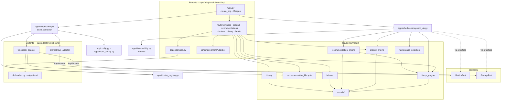

# Diagramme 3 — Relations entre modules (V1)

> Retour : [ARCHITECTURE](../ARCHITECTURE.md)

```mermaid
flowchart TB
    subgraph IN["Entrants — app/adapters/inbound/api/"]
        MAIN["main.py<br/>create_app · lifespan"]
        DEP["dependencies.py"]
        ROUT["routers : finops · greenit · recommendations<br/>clusters · history · health"]
        SCH["schemas/ (DTO Pydantic)"]
    end
    COMP["app/composition.py<br/>build_container"]
    REG["app/cluster_registry.py"]
    CFG["app/config.py · app/cluster_config.py"]
    JOB["app/scheduler/snapshot_job.py"]
    OBS["app/observability.py<br/>/metrics"]
    subgraph PORTS["app/ports/"]
        MP["MetricsPort"]
        SP["StoragePort"]
    end
    subgraph DOM["app/domain/ (pur)"]
        FE["finops_engine"]
        GE["greenit_engine"]
        RE["recommendation_engine"]
        LC["recommendation_lifecycle"]
        FO["failover"]
        HI["history"]
        NS["namespace_selection"]
        MOD["models/"]
    end
    subgraph OUT["Sortants — app/adapters/outbound/"]
        PA["prometheus_adapter"]
        TA["timescale_adapter"]
        ORM["db/models.py · migrations/"]
    end

    MAIN --> COMP --> PA & TA
    COMP --> REG
    COMP --> CFG
    MAIN --> JOB
    MAIN --> ROUT
    ROUT --> DEP --> REG
    ROUT --> SCH
    ROUT --> FE & GE & FO & HI & LC
    JOB --> FE & GE & RE & NS
    JOB --> OBS
    JOB -.->|via interface| MP
    JOB -.->|via interface| SP
    RE --> FE
    FE & GE & RE & FO & HI --> MOD
    PA -- implémente --> MP
    TA -- implémente --> SP
    TA --> LC
    TA --> ORM
```
